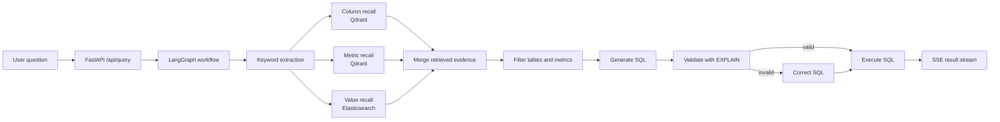

# Data Agent

Metadata-enhanced Text-to-SQL data query agent for retail data warehouse scenarios.

This project explores how to make an LLM-based data agent less dependent on direct SQL guessing. Instead of asking the model to generate SQL from a natural-language question alone, the system first retrieves structured business evidence from metadata stores, vector indexes, and value indexes, then uses the retrieved context to generate, validate, correct, and execute SQL.

## Highlights

- **Multi-route recall for Text-to-SQL grounding**: retrieves schema fields, business metrics, and dimension values through separate retrieval paths.
- **Heterogeneous retrieval design**: uses Qdrant for semantic field/metric retrieval, Elasticsearch for value matching, and MySQL for structured metadata completion.
- **LangGraph agent workflow**: decomposes NL2SQL into keyword extraction, column/metric/value recall, context merging, filtering, SQL generation, validation, correction, and execution.
- **SQL validation loop**: uses database `EXPLAIN` feedback before execution to reduce invalid SQL.
- **Streaming observability**: exposes an SSE endpoint and a lightweight web UI to inspect each agent step.

## Architecture



More details: [docs/architecture.md](docs/architecture.md)

## Repository Map

```text
app/api/                 FastAPI entrypoint, routing, dependency injection
app/agent/               LangGraph state, context, graph, and nodes
app/services/            Query service and metadata knowledge builder
app/repositories/        MySQL, Qdrant, and Elasticsearch access layers
conf/                    Metadata config and sanitized app config template
docker/                  Local MySQL, ES, Qdrant, Kibana, and embedding services
prompts/                 Prompt templates for recall, filtering, SQL generation
app/static/              Lightweight web UI
```

## Example Questions

- `统计华北地区的销售总额`
- `各品类的销售额排名`
- `不同会员等级的平均订单金额`

See [docs/query_examples.md](docs/query_examples.md).

## Setup

1. Install dependencies.

```powershell
uv sync
```

2. Prepare local config.

```powershell
Copy-Item conf\app_config.example.yaml conf\app_config.yaml
```

Then edit `conf/app_config.yaml` with your local database, embedding, Elasticsearch, Qdrant, and LLM settings.

3. Start backend services with Docker if needed.

```powershell
cd docker
docker compose up -d
```

The compose file starts MySQL, Elasticsearch, Kibana, Qdrant, and a Hugging Face TEI embedding service. MySQL uses demo credentials by default:

```text
user: atguigu
password: data_agent_password
```

You can override them with environment variables such as `MYSQL_USER` and `MYSQL_PASSWORD`.

4. Build metadata knowledge.

```powershell
.venv\Scripts\python.exe -m app.scripts.build_meta_knowledge -c conf\meta_config.yaml
```

5. Run the API and UI.

```powershell
.venv\Scripts\uvicorn.exe app.api.main:app --host 127.0.0.1 --port 8000 --reload
```

Open `http://127.0.0.1:8000/`.

## Notes

- `conf/app_config.yaml` is intentionally ignored because it contains local credentials and API keys.
- Use `conf/app_config.example.yaml` as the public template.
- The current benchmark data is a compact retail warehouse prototype for demonstrating schema grounding, value grounding, and SQL validation.
